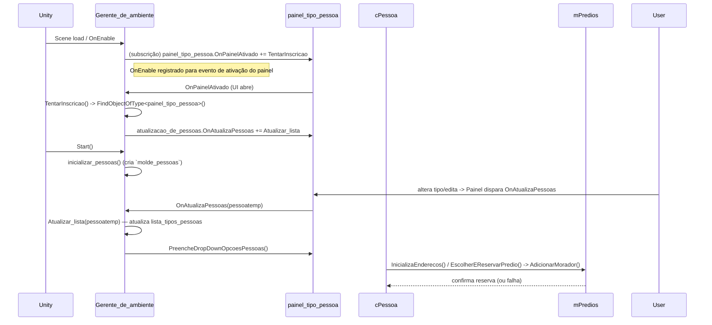

```mermaid
sequenceDiagram
participant Unity
participant Gerente as Gerente_de_ambiente
participant Painel as painel_tipo_pessoa
participant Pessoa as cPessoa
participant Predio as mPredios

Unity->>Gerente: Scene load / OnEnable
Gerente->>Painel: (subscrição) painel_tipo_pessoa.OnPainelAtivado += TentarInscricao
Note right of Gerente: OnEnable registrado para evento de ativação do painel

Painel->>Gerente: OnPainelAtivado (UI abre)
Gerente->>Gerente: TentarInscricao() -> FindObjectOfType<painel_tipo_pessoa>()
Gerente->>Painel: atualizacao_de_pessoas.OnAtualizaPessoas += Atualizar_lista

Unity->>Gerente: Start()
Gerente->>Gerente: inicializar_pessoas() (cria `molde_pessoas`)

User->>Painel: altera tipo/edita -> Painel dispara OnAtualizaPessoas
Painel->>Gerente: OnAtualizaPessoas(pessoatemp)
Gerente->>Gerente: Atualizar_lista(pessoatemp) — atualiza lista_tipos_pessoas
Gerente->>Painel: PreencheDropDownOpcoesPessoas()

Pessoa->>Predio: InicializaEnderecos() / EscolherEReservarPredio() -> AdicionarMorador()
Predio-->>Pessoa: confirma reserva (ou falha)
```