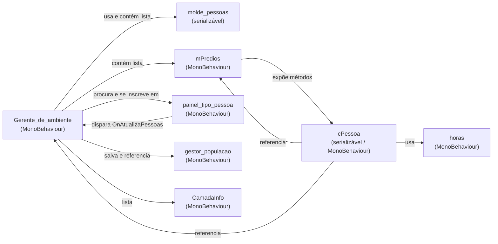

```mermaid
graph LR
A["Gerente_de_ambiente\n(MonoBehaviour)"]
B["molde_pessoas\n(serializável)"]
C["mPredios\n(MonoBehaviour)"]
D["painel_tipo_pessoa\n(MonoBehaviour)"]
E["cPessoa\n(serializável / MonoBehaviour)"]
F["horas\n(MonoBehaviour)"]
G["gestor_populacao\n(MonoBehaviour)"]
H["CamadaInfo\n(MonoBehaviour)"]

A -->|usa e contém lista| B
A -->|contém lista| C
A -->|procura e se inscreve em| D
D -->|dispara OnAtualizaPessoas| A
E -->|referencia| C
E -->|referencia| A
E -->|usa| F
A -->|salva e referencia| G
A -->|lista| H
C -->|expõe métodos| E
```